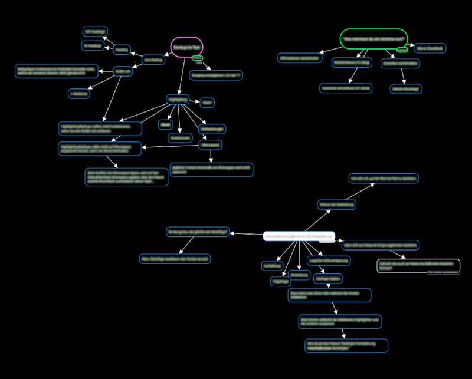
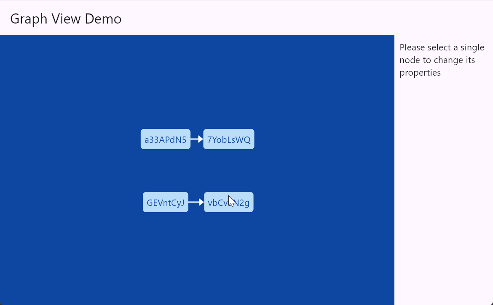

A performant rendering library for displaying and manipulating custom-defined graph structures through a simple and intuitive API, that gives you maximum control over the graph's look and feel.  
It was designed from the ground up to be fully integrated with flutter's architecture.



## Features

- Custom graph viewport, node and edge widgets
- Children arre built lazily (only when necessary)
- Built-in panning, scaling and scrolling of the viewport
- Built-in dragging of one or multiple nodes
- Custom styling
- Flutter `Theme` integration
- Intuitive API
- Graph-structure-agnnostic: You can define your own types and classes for the graph-structure - the package only knows of the IDs 

## Getting started

Add this package to your `pubspec.yaml` file:

```bash
$ flutter pub add interactive_graph_view
```

## Usage

### 1. Import the package

```dart
import "package:interactive_graph_view/interactive_graph_view.dart";
```

### 2. Create and save a `GraphViewportController` in your `StatefulWidget` and give it your graph structure's IDs

```dart
class YourWidget extends StatefulWidget {
  const YourWidget({super.key});

  @override
  State<YourWidget> createState() => _YourWidgetState();
}

class _YourWidgetState extends State<YourWidget> {
  final Map<NodeId, ExampleNode> _nodes = {
    "node-1": ExampleNode(position: (0, -75), text: "Hello"),
    "node-2": ExampleNode(position: (0, 75), text: "World"),
  };
  final Map<EdgeId, ExampleEdge> _edges = {
    "edge-1": ExampleEdge(startNodeId: "node-1", endNodeId: "node-2", text: "wonderful"),
  }

  late final GraphViewportController<String, String> _graphViewportController;

  @override
  void initState() {
    super.initState();

    _graphViewportController = GraphViewportController(
      initialNodeIds: _nodes.keys,
      initialEdgeIds: _edges.keys,
    );
  }

  // ...
}
```

### 3. Build the `GraphView` or `GraphViewport` in your widget's build() method

```dart
@override
Widget build(BuildContext context) {
  return Scaffold(
    appBar: AppBar(
      title: Text("Graph View Demo"),
    ),
    body: GraphView<String, String>(
      viewportController: _graphViewportController,
      nodeBuilder: (context, nodeId) {
        final ExampleNode node = _nodes[nodeId]!;
        return NodeWidget.basic(
          position: node.position,
          text: node.text,
          isDragEnabled: true,
        );
      },
      edgeBuilder: (context, edgeId) {
        final ExampleEdge edge = _edges[edgeId]!;
        return EdgeWidget(
          startNodeId: edge.startNodeId,
          endNodeId: edge.endNodeId,
          text: edge.text,
        );
      },
    ),
  );
}
```

## Examples

In the [`example` folder](example/) there are multiple examples that you can use to get a grasp of how to use this package:

### Minimal example

[`example/minimal.dart`](example/minimal.dart)

This is a minimal example that will only display two nodes and an edge connecting them.  
You can pan and scale the viewport, but you can not move the nodes themselves.  
This will use the package's default style for viewport, nodes and edges.


### Node selection and group move

[`example/selection_and_group_move.dart`](example/selection_and_group_move.dart)

This example shows you how you can implement selection of nodes and then being able to move them all at the same time.


### Styling and Themes

[`example/styling_and_themes.dart`](example/styling_and_themes.dart)

This example demonstrates the usage of styles: Both, in combination with [ThemeData] and as inline styles.


### Big example

[`example/main.dart`](example/main.dart)

This example combines most of the features and gives you an interactive demo.



## Contributing

You are welcome to contribute to this package!

If you've got a feature request or run into a bug, please do not hesitate to open an issue in the GitHub repository. 😊

## License

This package is under the [MPL 2.0 License](https://www.mozilla.org/en-US/MPL/2.0/).