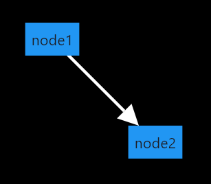
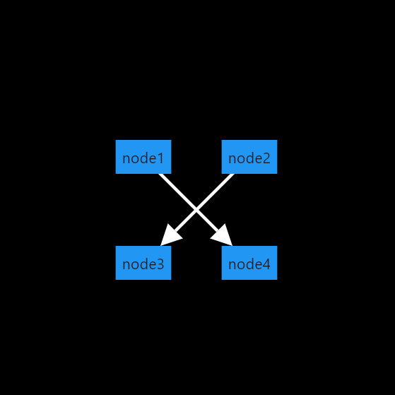
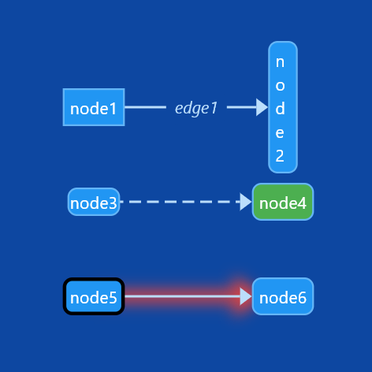

In the [`example` folder](./) there are multiple examples that you can use to get a grasp of how to use this package:

### Minimal example

[`example/minimal.dart`](./minimal.dart)

This is a minimal example that will only display two nodes and an edge connecting them.  
You can pan and scale the viewport, but you can not move the nodes themselves.  
This will use the package's default style for viewport, nodes and edges.

### Node selection and group move

[`example/selection_and_group_move.dart`](./selection_and_group_move.dart)

This example demonstrates how you can implement the selection of nodes and then being able to move multiple at once.

### Styling and Themes

[`example/styling_and_themes.dart`](./styling_and_themes.dart)

This example demonstrates the usage of styles: Both, in combination with `ThemeData` and as inline styles.

### Large example

[`example/large.dart`](./large.dart)

This example combines most of the features and gives you an interactive demo.

